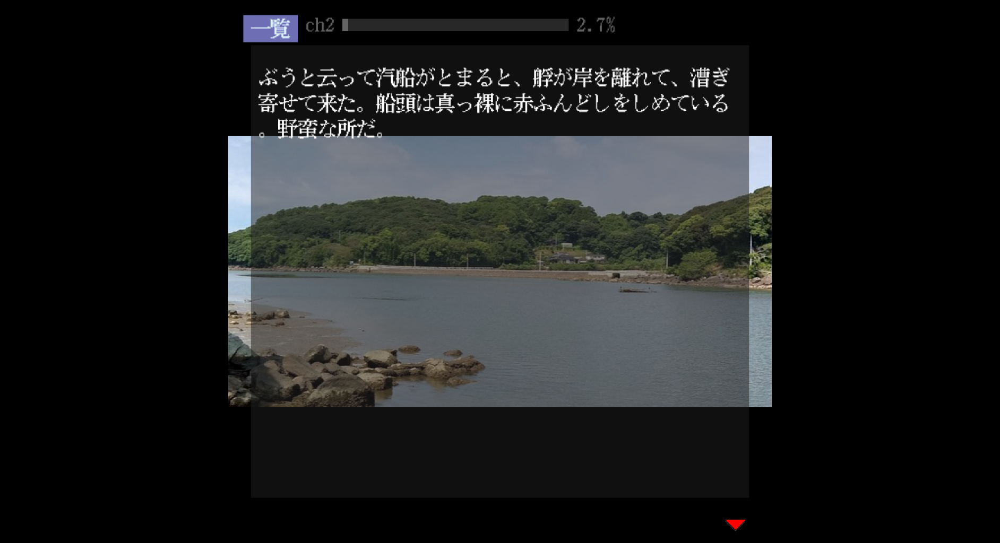

夏目漱石の作品をノベルゲーム風に読めるようにする。



- フォントは http://jikasei.me/font/jf-dotfont/ から拝借した
- 本文は夏目漱石『坊っちゃん』 https://www.aozora.gr.jp/cards/000148/files/752_14964.html から拝借した

## 青空文庫のルビを削除する方法

青空文庫のテキストにはルビが含まれていて、そのままコピペすると文章がおかしくなる。

https://qiita.com/kanaxx/items/6d6b0d680185d6af9b05 で紹介されている方法。

ブラウザのコンソールで↓を実行する。

```shell
$('rt').hide();
```
